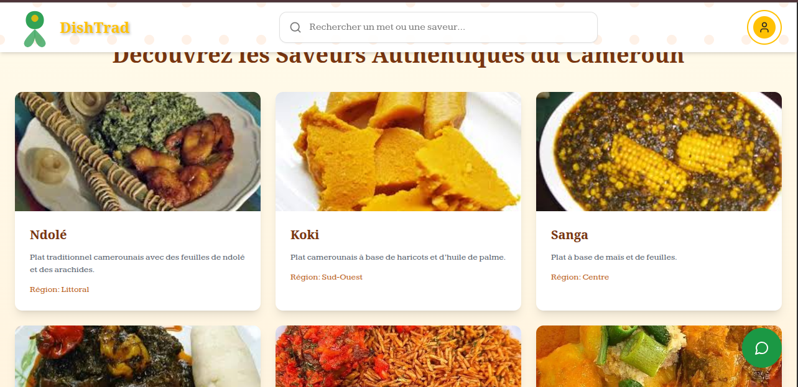

<p align="center">
  
</p>

# DishTrad – Valorisation de la Cuisine Africaine par l’IA

**DishTrad** est une plateforme intelligente qui valorise les plats traditionnels camerounais via l’intelligence artificielle. Elle combine :

* Une **interface web immersive** (React + Tailwind),
* Une **API REST sécurisée** (Node.js + MySQL),
* Un **chatbot IA spécialisé** (image + texte) utilisant **TensorFlow, LangChain, Gemini, ChromaDB**.

> 🛠️ Projet développé dans le cadre du **Hackathon CONIA 2025**
> 👥 Équipe : **CUSTOM AI TEAM**
> 🎯 Focus : **Reconnaissance et vulgarisation des mets traditionnels camerounais et ghanéens**

---

## 🔗 Modules du Projet

| Module         | Description                                           | Lien                                               |
| -------------- | ----------------------------------------------------- | -------------------------------------------------- |
| `frontend/`    | Interface utilisateur React (TS + Tailwind)           | 👉 [Voir le README Frontend](./frontend/README.md) |
| `backend/`     | API REST sécurisée, base de données, routes           | 👉 [Voir le README Backend](./backend/README.md)   |
| `chat_bot_ai/` | Serveur IA pour classification d’image et RAG chatbot | 👉 [Voir le README IA](./chat_bot_ai/README.md)    |

---

## 💻 Stack Technologique

| Côté       | Techs utilisées                                                            |
| ---------- | -------------------------------------------------------------------------- |
| Frontend   | React, Tailwind, Shadcn/ui, Vite                                           |
| Backend    | Node.js, Express, Sequelize, MySQL                                         |
| IA Chatbot | Python, TensorFlow Lite, LangChain, Gemini, ChromaDB                       |
| Données    | Fichier Excel (`African_Datasets_Ghana_Cameroon.xlsx`), SQL (`Recipe.sql`) |

---

## 📦 Instructions de Test Local

### 1. Cloner le projet

```bash
git clone https://github.com/brandoniscoding-dev/dishtrad-conia.git
cd dishtrad
```

---

### 2. Lancer le Backend

```bash
cd backend
npm install
npm run dev
```

* Serveur accessible sur `http://localhost:3000`
* Nécessite XAMPP ou un serveur MySQL local
* Base de données : `cameroonian_meals` (importer `Recipe.sql`)
* Voir : [backend/README.md](./backend/README.md)

---

### 3. Lancer le Frontend

```bash
cd frontend
npm install --force
npm run dev
```

* Front React + Tailwind
* Accès sur `http://localhost:5173` ou autre port Vite
* Voir : [frontend/README.md](./frontend/README.md)

---

### 4. Lancer le Serveur IA

```bash
cd chat_bot_ai

# Création de l’environnement virtuel Python
python3 -m venv env
source env/bin/activate

# Installation des dépendances
pip install -r requirements.txt

# Configuration .env
cp .env.example .env
# Puis modifier les champs (clé Gemini, chemin Python, DB...)

# Import de la base SQL
mysql -u root -p cameroun_cuisine_db < Recipe.sql

# Ingestion de la base de connaissances
python src/module_ia/ingest.py

# Lancement du serveur
npm install
npm run dev
```

* UI du chatbot : `http://localhost:3000`
* Voir : [chat\_bot\_ai/README.md](./chat_bot_ai/README.md)

---

## ✅ Cas de test recommandés

| Fonction                | Comment tester                                                               |
| ----------------------- | ---------------------------------------------------------------------------- |
| Navigation plats        | Depuis l'accueil (`/`), afficher les plats et cliquer pour voir les recettes |
| Connexion / Inscription | Utiliser les modales (`LoginModal.tsx`, `RegisterModal.tsx`)                 |
| API sécurisées          | Tester avec `X-User-Id`, `X-User-Role` ou via Postman                        |
| Chatbot – Texte         | Poser une question en français dans `/api/chatbot` ou via UI                 |
| Chatbot – Image         | Uploader une image de plat local (ex. `eru.jpeg`, `jollof.jpg`)              |
| Résilience API          | Tester avec données manquantes ou mauvaises extensions                       |

---

## 🎯 Objectifs Atteints

* ✅ IA embarquée, efficace et rapide (TensorFlow Lite)
* ✅ Architecture modulaire : découplage Front / Back / IA
* ✅ Ingestion hybride (Excel + SQL → vecteurs Markdown)
* ✅ Interface utilisateur claire et agréable
* ✅ Infrastructure robuste et testable localement

---

## 📎 Contact & Mention

**Projet présenté par :** CUSTOM AI TEAM
**Hackathon CONIA 2025**
📧 contact : [brandoniscoding@gmail.com](mailto:brandoniscoding@gmail.com)


